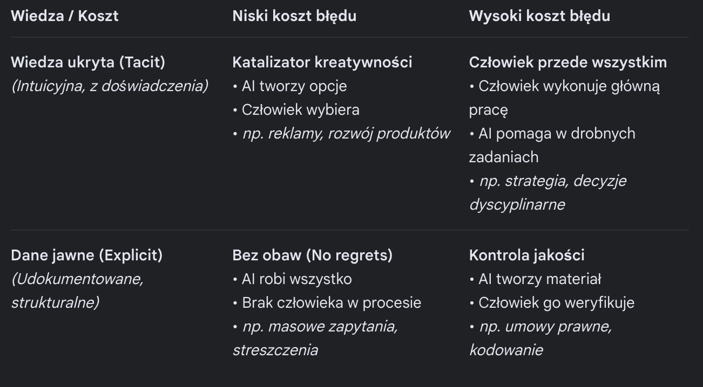
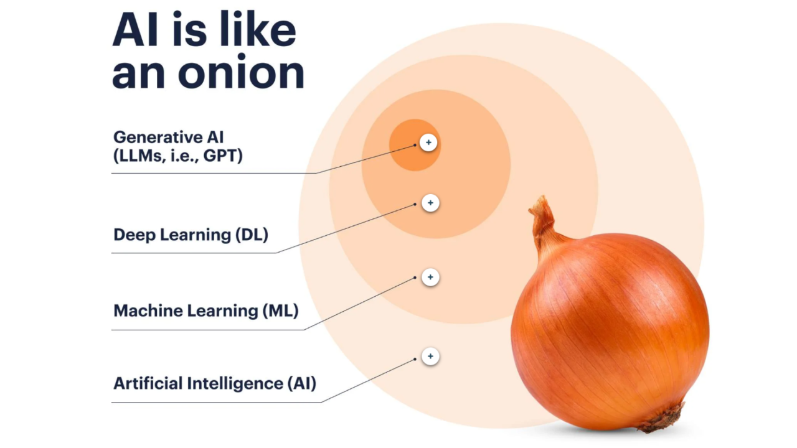
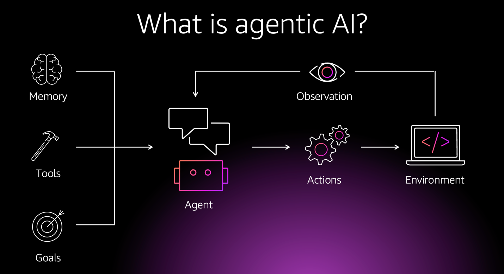
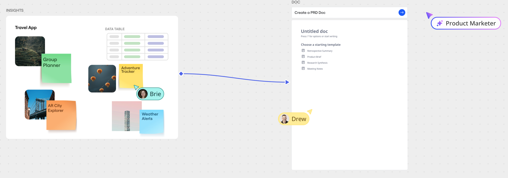
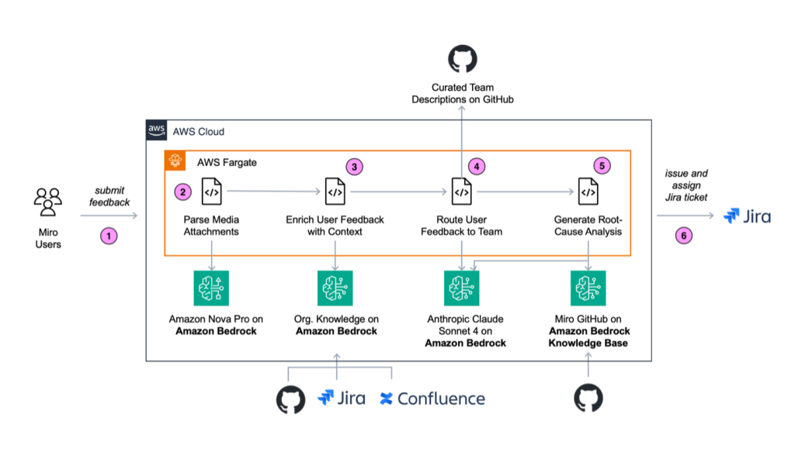
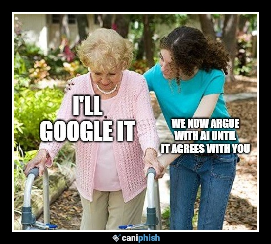
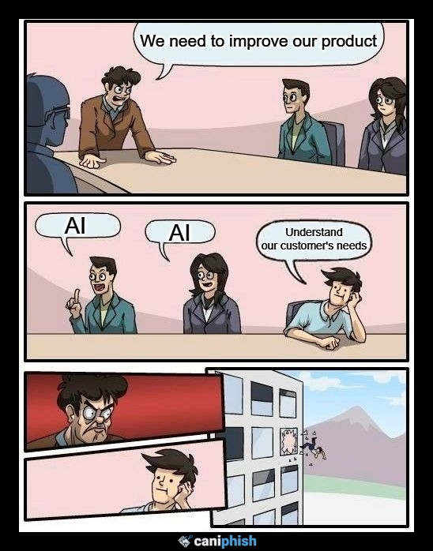
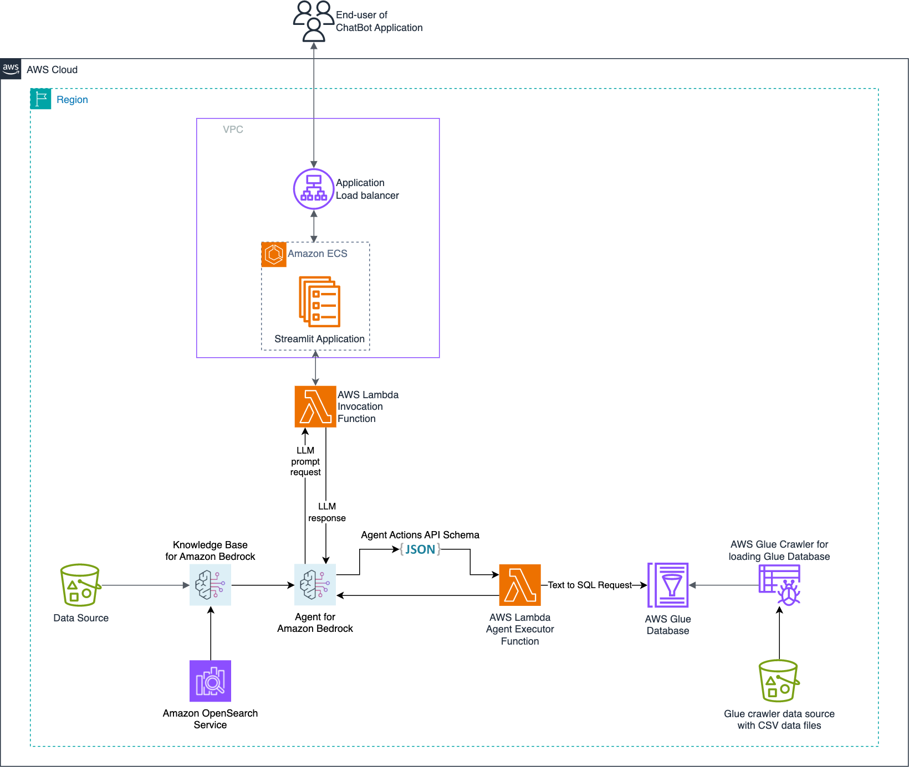
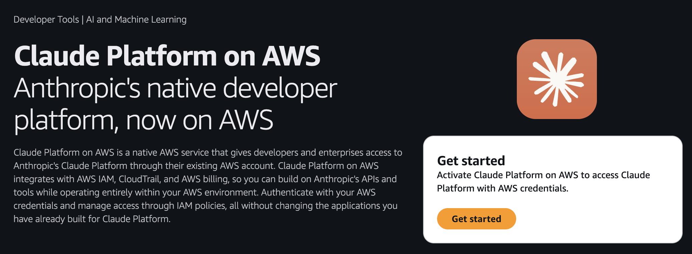

# Agenda

## 1. Krótko o Trek2Summit i o mnie
## 2. Dlaczego AI nie jest lekiem na całe zło?
## 3. Kiedy warto, a kiedy to jest bez sensu
## 4. Czym jest agent AI i co się stało z przedrostkiem Gen?
## 5. Duże wdrożenie, memy, małe wdrożenia
## 6. Co polecam na start
## 7. Q&A

<!-- end_slide -->

# Trek2Summit

<!-- pause -->

## Spejaliści chmurowi i nie tylko: AI, DevOps, Security, FinOps, Backup, Managed Services

<!-- pause -->

## Biura w Polsce i Wielkiej Brytanii

<!-- pause -->

## Klienci głównie z SMB, ale także Public i Enterprise

<!-- end_slide -->

# O mnie

## Rafał Król

<!-- pause -->

## 10 lat pracy z AWS | 10+ zdanych egzaminów AWSowych | AWS Community Builder

<!-- pause -->

## obecnie Head of AWS Technologies | wcześniej Principal Solutions Architect, Cloud SRE, Software Engineer...

<!-- pause -->

<!-- pause -->

### Ze Stewarda w DevOpsa 👉 *https://www.youtube.com/@ZmieniamNaIT*

<!-- end_slide -->

# Dlaczego AI nie jest lekiem na całe zło?

<!-- column_layout: [1, 1] -->
<!-- column: 0 -->

<!-- pause -->

<!-- pause -->

## Airbus A320

<!-- pause -->

## W służbie komercyjnej od 1988

<!-- pause -->

## Potrafi sam lądować

<!-- pause -->

<!-- column: 1 -->

<!-- end_slide -->

# Kiedy warto, a kiedy to jest bez sensu

<!-- column_layout: [1, 1] -->
<!-- column: 0 -->
<!-- pause -->
### Dobry kandydat
- Zadanie **wieloetapowe**, wymaga decyzji
- Dane są **dostępne i w miarę czyste**
- Błąd jest **odwracalny** lub wykrywalny
- **Setki/tysiące** przypadków dziennie
- Człowiek robi to samo, tylko **wolniej i drożej** lub niechętnie
- Wynik probabilistyczny jest akceptowalny, np. klasyfikacja zgłoszeń, podsumowania
<!-- column: 1 -->
<!-- pause -->
### Zły kandydat
- **Jednorazowe** zadanie o niskim poziomie skomplikowania
- Dane **wrażliwe bez odpowiedniego nadzoru (governance)**
- Błąd jest **katastrofalny i nieodwracalny**
- Brak możliwości **ewaluacji jakości**
- Wymagana **100% pewność** odpowiedzi
- Bardzo niski wolumen (< kilkanaście zapytań/mc)
- Wynik musi być deterministyczny, np. naliczanie podatku, dawkowanie leku

<!-- end_slide -->

# Czym jest agent AI i co się stało z przedrostkiem Gen?

<!-- column_layout: [1, 1] -->
<!-- column: 0 -->
<!-- pause -->

<!-- column: 1 -->
<!-- pause -->

<!-- reset_layout -->
<!-- pause -->
## Zmiana obietnicy biznesowej od *tworzenia* do *działania*
<!-- column_layout: [1, 1] -->
<!-- column: 0 -->
<!-- pause -->
### GenAI
* **Główna funkcja:** Tworzenie nowych treści (tekst, kod, obrazy, wideo)
* **Tryb pracy:** Reaktywny (czeka na prompt/polecenie użytkownika)
* **Interakcja:** Zazwyczaj krótka, jednoetapowa (Q&A)
* **Autonomia:** Niska; wymaga ciągłego nadzoru człowieka
* **Przykład:** Napisz e-mail, stwórz grafikę, podsumuj dokument
* **Rola:** Narzędzie zwiększające produktywność
<!-- column: 1 -->
<!-- pause -->
### Agentic AI
* **Główna funkcja:** Podejmowanie działań i realizacja złożonych zadań
* **Tryb pracy:** Proaktywny (działa samodzielnie po otrzymaniu celu)
* **Interakcja:** Długotrwała, wieloetapowe planowanie i rozumowanie
* **Autonomia:** Wysoka; podejmuje decyzje i koryguje działanie
* **Przykład:** *Zaplanuj podróż służbową*, co oznacza: znalezienie lotu, rezerwację hotelu, wpisanie do kalendarza
* **Rola:** Autonomiczny wykonawca procesów
<!-- reset_layout -->
<!-- pause -->
> Google zmieniło nazwę serwisu Vertex AI na Gemini Enterprise Agent Platform by odzwierciedlić powyższe,
> a AWS stworzył zupełnie nowy serwis Amazon Bedrock AgentCore do orkiestracji agentów.
<!-- end_slide -->

# Miro – routing zgłoszeń od klientów końcowych (1/2)
<!-- pause -->
## Miro to internetowa platforma do wizualnej współpracy, która działa jak wirtualna, nieskończona tablica dla wielu zespołów.
<!-- column_layout: [1, 1] -->
<!-- column: 0 -->

<!-- column: 1 -->
<!-- pause -->
**Problem:** zgłoszenia błędów w dużej organizacji inżynierskiej trafiały do niewłaściwych zespołów (jest ich prawie 100). Marnotrawienie czasu i powodowanie frustracji.
<!-- pause -->

<!-- reset_layout -->
<!-- column_layout: [1, 1] -->
<!-- column: 0 -->

<!-- column: 1 -->
**Rozwiązanie:**
- **Amazon Bedrock** – klasyfikacja zgłoszeń na podstawie kontekstu
- Integracja z wewnętrznym systemem bugtrackingu
- Agent analizuje treść + metadane, decyduje do którego zespołu trafia issue

1. Przesłanie raportu z opinią użytkownika (zgłoszenia błędu).
2. Przetworzenie załączników multimedialnych.
3. Wzbogacenie opinii użytkownika o kontekst.
4. Skierowanie opinii użytkownika do odpowiedniego zespołu.
5. Wygenerowanie analizy przyczyn źródłowych.
6. Przekazanie wyników użytkownikowi do wglądu.
<!-- pause -->

<!-- end_slide -->

# Miro – routing zgłoszeń od klientów końcowych (2/2)

**Wyniki:**
| Metryka | Wynik |
|---------|-------|
| Liczba tzw. reassignments między zespołami | **6× mniej** |
| Czas do rozwiązania | **5× krótszy** (dni → godziny) |
<!-- pause -->
### Dlaczego ten casus jest ważny?
- Nie jest to pilot czy demo, a produkcyjne wdrożenie w firmie o skali enterprise
- Pokazuje, że często największa wartość bywa wewnątrz organizacji
- Relatywnie *prosty use case* z jasnym, mierzalnym zwrotem z inwestycji

> Źródło: https://aws.amazon.com/blogs/machine-learning/how-miro-uses-amazon-bedrock-to-boost-software-bug-routing-accuracy-and-improve-time-to-resolution-from-days-to-hours/

<!-- end_slide -->

# Memy

<!-- pause -->
1. AI jest faktem

<!-- pause -->

<!-- column_layout: [1, 1] -->
<!-- column: 0 -->
<!-- pause -->
2. Inwestorzy chcą AI wszędzie...

<!-- column: 1 -->
<!-- pause -->
3. ...klienci niekoniecznie

<!-- end_slide -->

# Intelligent Documentation Agent

<!-- end_slide -->

# Co polecam na start?

+ skorzystanie z darmowych wersjei popularnych narzędzi: Kiro (IDE), Google AI studio, ElevenLabs?
+ obejrzenie innych sesji GigaCon
+ darmową rozmowę z nami
+ śledznie nas i mnie na LinkedInie
+ Claude Platform on AWS, jeśli już jesteście na AWSie

<!-- end_slide -->

<!-- column_layout: [2, 2] -->

<!-- column: 0 -->
<!-- jump_to_middle -->

# Dziękuję!

## 🌐 www.trek2summit.com
## 🌐 linkedin.com/company/trek2summit
## 🤝 linkedin.com/in/rafal-krol
### 🛠️ kiro.dev
### 🛠️ github.com/rafalkrol-xyz/mAI-consigliere

# Pytania?

<!-- column: 1 -->

