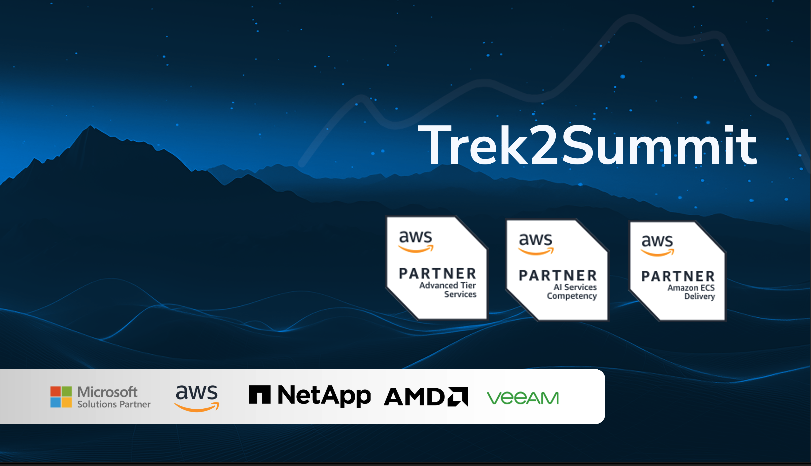
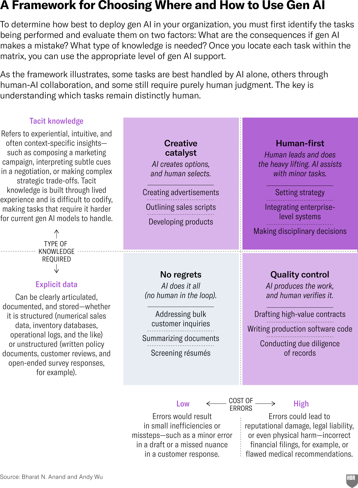
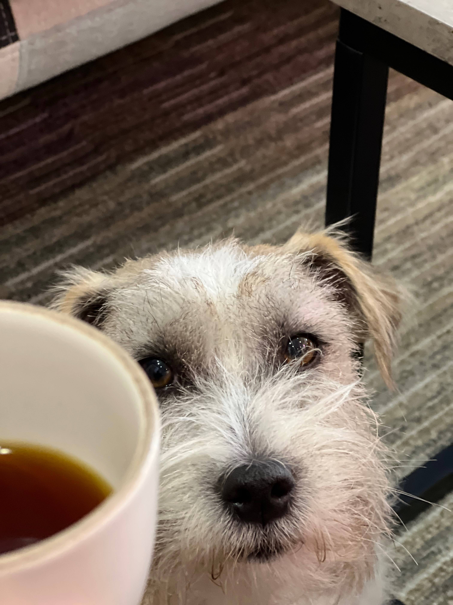

# Agenda

## 1. Krótko o Trek2Summit i o mnie
## 2. Dlaczego AI nie jest lekiem na całe zło?
### a. kiedy warto, a kiedy to jest bez sensu // Pułapki i kryteria decyzyjne – kiedy ma sens, kiedy nie
  * Co mówi nauka – HBR: 7 czynników ROI z AI (2026)
3. Czym jest agent AI i co się stało z przedrostkiem Gen?
4. Duże wdrożenia, małe wdrożenia i spektakularne klęski
5. Amazon Bedrock + AgentCore – platforma pod maską
6. Co polecam na start
7. Q&A

<!-- end_slide -->

# Trek2Summit

<!-- pause -->

## Spejaliści chmurowi i nie tylko: AI, DevOps, Security, FinOps, Backup, Managed Services

<!-- pause -->

## Biura w Polsce i Wielkiej Brytanii

<!-- pause -->

## Klienci głównie z SMB, ale także Public i Enterprise

<!-- end_slide -->

# O mnie

## Rafał Król

<!-- pause -->

## 10 lat pracy z AWS | 10+ zdanych egzaminów AWSowych | AWS Community Builder

<!-- pause -->

## obecnie Head of AWS Technologies | wcześniej Principal Solutions Architect, Cloud SRE, Software Engineer...

<!-- pause -->

<!-- pause -->

### Ze Stewarda w DevOpsa 👉 *https://www.youtube.com/@ZmieniamNaIT*

<!-- end_slide -->

# Dlaczego AI nie jest lekiem na całe zło?

<!-- column_layout: [1, 1] -->
<!-- column: 0 -->

<!-- pause -->

<!-- pause -->

## Airbus A320

<!-- pause -->

## W służbie komercyjnej od 1988

<!-- pause -->

## Potrafi sam lądować

<!-- pause -->

<!-- column: 1 -->

<!-- end_slide -->
<!-- end_slide -->

<!-- column_layout: [2, 2] -->

<!-- column: 0 -->
<!-- jump_to_middle -->

# Dziękuję!

## 🌐 www.trek2summit.com
## 🌐 linkedin.com/company/trek2summit
## 🤝 linkedin.com/in/rafal-krol
### 🛠️ kiro.dev
### 🛠️ github.com/rafalkrol-xyz/mAI-consigliere

# Pytania?

<!-- column: 1 -->

